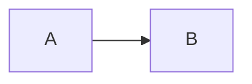

# Markdown Compatibility Policy

## 1. Problem statement

"Markdown" is not one universal feature set.

The application must support a broad ecosystem while avoiding a proprietary dialect.

## 2. Baseline

Target a standards-oriented baseline consisting of:

- CommonMark-compatible core parsing behavior;
- GitHub Flavored Markdown-style extensions where useful.

Initial practical features include:

- headings;
- emphasis;
- strong;
- blockquotes;
- ordered/unordered lists;
- links;
- images;
- inline/fenced code;
- horizontal rules;
- tables;
- task lists;
- strikethrough;
- autolinks.

## 3. First-class extensions

### YAML frontmatter

Recognize frontmatter without requiring the application to own every field.

Unknown fields must be preserved.

### Mathematics

Support common inline/block math conventions, rendered locally through a MathJax-compatible solution.

Typical input:

```text
$E = mc^2$

$$
P = VI\cos(\phi)
$$
```

Source remains plain Markdown/TeX text.

### Mermaid

Recognize fenced blocks:

````text

````

Render locally when possible.

If rendering fails, preserve and display the source block.

### Wikilinks

Target:

```text
[[Note]]
[[Note|Alias]]
[[Note#Heading]]
```

Resolution belongs to workspace functionality, not generic Markdown parsing.

### Callouts/admonitions

Support a documented interoperable convention.

Do not invent a project-specific callout syntax unless existing conventions are technically insufficient.

### Syntax-highlighted code

Support fenced language identifiers without requiring the language to be known.

Unknown languages remain ordinary code blocks.

## 4. HTML policy

Raw HTML creates a security boundary.

Default preview behavior must prevent arbitrary untrusted script execution or privileged bridge access.

If a future "unsafe HTML" mode exists, it must be explicit and clearly scoped.

Never expose broad filesystem/system capabilities to document JavaScript.

## 5. Preservation invariant

This is mandatory:

> Opening, previewing and saving a document must not remove syntax merely because the current parser does not understand it.

Example:

````text
```future-diagram
arbitrary syntax
```
````

The source must survive intact even if preview shows only a code block.

## 6. Toolbar policy

Toolbar actions insert portable source syntax.

Examples:

- Bold -> `**text**`
- Math -> `$...$` or `$$...$$`
- Mermaid -> fenced `mermaid` block
- Table -> Markdown table
- Link -> Markdown link
- Image -> Markdown image
- Wikilink -> `[[...]]`

Toolbar state must not create hidden formatting unavailable in the `.md` source.

## 7. Compatibility fixtures

Maintain fixtures for at least:

- baseline Markdown;
- GFM extensions;
- YAML frontmatter;
- math;
- Mermaid;
- wikilinks;
- callouts;
- SVG/image references;
- HTML edge cases;
- unknown fenced languages;
- unknown directives/custom syntax.

Tests should verify both rendering intent and source preservation where applicable.
