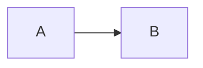

# Título
## Subtítulo
Texto com **bold**, *italic* e ~~strike~~.

| A | B |
|---|---|
| 1 | 2 |

- [x] tarefa
- [ ] outra tarefa

$$ E = mc^2 $$

[[Nota futura]]
```unknown-language
do_not_modify_this();
```
:::unknown-directive
preserve this too
:::

ação medição tensão
Ω Δ φ ∑ √ ≈ ≤ ≥
日本語 Русский 中文 ⚡


[HTTPS](https://example.com) [FILE](file:///C:/Windows/System32) [JS](javascript:alert(1)) [DATA](data:text/html,<script>alert(1)</script>)
<b>HTML</b>
<script>window.__malicious_test = true;</script>
