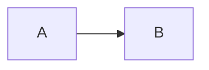

# Título

Texto com **bold**, *italic* e ~~strike~~.

| A | B |
|---|---|
| 1 | 2 |

- [x] tarefa
- [ ] outra tarefa

$$
E = mc^2
$$



[[Nota futura]]

```unknown-language
do_not_modify_this();
```

:::unknown-directive
preserve this too
:::

Português: ação, medição, instalação, tensão
Ω Δ φ ∑ √ ≈ ≤ ≥
日本語 Русский 中文 ⚡
